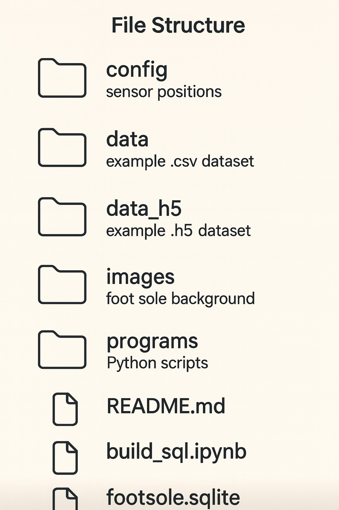
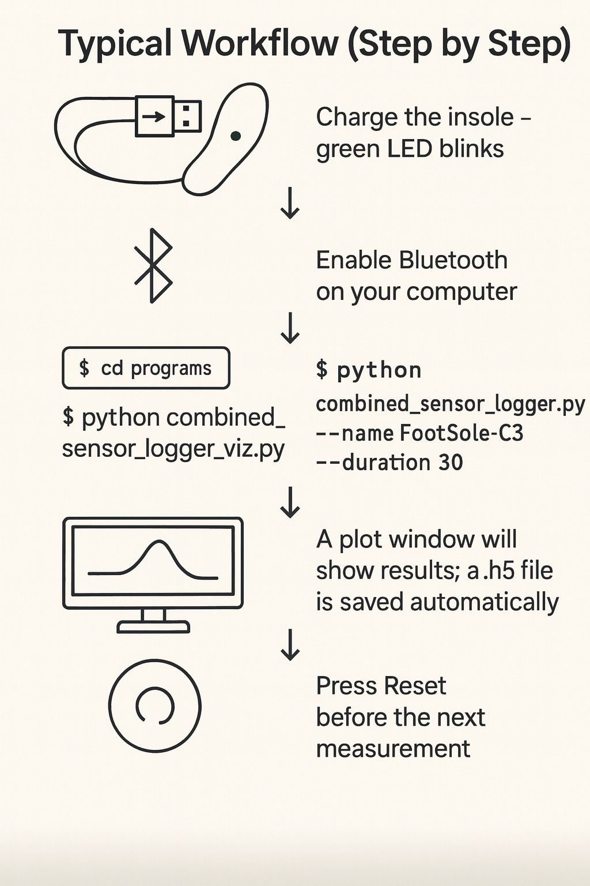

# Foot Sole Sensor

> **Note Before You Begin**
>
> Before you start reading how to use our sensor, please note that this project is developed based on the original **wired version** of the footsole pressure sensor project.  
> The original repository can be found here: [https://github.com/weichkai/footPressureSensor.git](https://github.com/weichkai/footPressureSensor.git).  
> 
> This work has been carried out **with authorization and permission** from the original project owner (Kai), and we have further optimized and extended the project.


This project uses pressure sensors embedded in insoles. An ESP32 sends data via **BLE (Bluetooth Low Energy)** to a computer. Python scripts record the data into `.h5` files and provide visualization.

---

## Table of Contents
- [Hardware Setup](#hardware-setup)
- [UART Communication (used in this project)](#uart-communication-used-in-this-project)
- [Software Setup](#software-setup)
- [Repository Structure](#repository-structure)
- [Scripts Overview](#scripts-overview)
- [Typical Workflow (Step by Step)](#typical-workflow-step-by-step)
- [Data Files](#data-files)
- [BLE Logic (Simplified)](#ble-logic-simplified)
- [FAQ](#faq)

---

## Hardware Setup
- **Power & Charging:** Charge the insole sensor with a **USB-C cable**. Ready status is indicated by a **blinking green LED**.  
- **Placement:** Place the insole flat inside the shoe. Specify left/right when running scripts.  
- **Reset:** After every measurement you **must press Reset** to ensure the next recording starts cleanly.

---

## UART Communication (used in this project)
- The sensor module supports both **I²C** and **UART**.  
- In this project, we **use UART**.  
- **Wiring:**
  - **GND ↔ GND**
  - **TX ↔ RX**
  - **RX ↔ TX**
  - **3.3 V ↔ VCC**
- BLE is used to **wirelessly transmit** the UART data to the computer.

---

## Software Setup
1. Install **Python 3.9+**.  
2. From the repository root:
   ```bash
   pip install -r requirements.txt
   ```
3. Ensure your computer's **Bluetooth** is enabled.

---

## Repository Structure



* `config/` — sensor position CSV files (left/right).
* `data/` — general data folder (optional scratch space).
* `data_csv/` — exported sensor data in CSV format.
* `data_h5/` — recorded sensor data in HDF5 format.
* `images/` — background images used for visualization.
* `programs/` — main Python scripts for logging/visualization.
* `README.md` — this documentation.
* `footsole.sqlite` — SQLite database file.
* `requirements.txt` — Python dependency list.

> Tip: Run scripts **from the `programs/` folder** so relative paths to `config/` and `images/` resolve correctly.

---

## Scripts Overview

All scripts are located in `programs/`.

### `combined_sensor_logger_viz.py` (recommended)

* Combined **logger + visualizer** in one script.
* Options:

  * `--name` device name (default `FootSole-C3`)
  * `--left` record left foot (default: right)
  * `--duration` recording time in seconds (default: 60)
  * `--side auto|left|right` choose visualization side (default: auto)
  * `--no-viz` only save data, no plot
  * `--save-frames` export PNG frames

**Examples**

```bash
# Right foot, 60 seconds with visualization
python combined_sensor_logger_viz.py (Using default configuration)
python combined_sensor_logger_viz.py --name FootSole-C3 --duration 60 (For personal configuration)

# Left foot, 30 seconds, no visualization
python combined_sensor_logger_viz.py --name FootSole-C3 --left --duration 30 --no-viz (For personal configuration)
```

### `foot_sole_ble_visualizer.py`

* Collects data via BLE and visualizes **after** recording.

**Examples**

```bash
python foot_sole_ble_visualizer.py (Using default configuration)
python foot_sole_ble_visualizer.py --name FootSole-C3 --duration 60
python foot_sole_ble_visualizer.py --name FootSole-C3 --left --duration 30 --no-display
```

### `log_velostat_sensor_h5_BLE.py`

* **Record only** (no visualization).

**Examples**

```bash
python log_velostat_sensor_h5_BLE.py --name FootSole-C3 --duration 60
python log_velostat_sensor_h5_BLE.py --name FootSole-C3 --left --duration 30
```

### `viz_sensor_data_no_video.py`

* Visualize an existing `.h5` file.

**Example**

```bash
python viz_sensor_data_no_video.py ../data_h5/sensor_right_YYYY-MM-DD-HH-MM-SS.h5 --side right
```

### `build_sql.py`

* Tranform `.h5` files to `.csv` and build a database that consists of tables and views. Database schema is available here: https://drawsql.app/teams/tum-12/diagrams/footsole.

### Utilities

* `checkh5.py` — inspect `.h5` structure and preview rows.
* `velostat_sensor_to_pressure.py` — convert raw values to pressure (Pa).
* `frames_to_video.py` / `frames_to_video_html.py` — convert exported frames to video/HTML.

---

## Typical Workflow (Step by Step)



1. Charge the insole → **green LED blinks**.
2. Enable **Bluetooth** on your computer.
3. Open a terminal and go to the scripts folder:

   ```bash
   cd programs
   ```
4. Run:

   ```bash
   python combined_sensor_logger_viz.py --name FootSole-C3 --duration 30
   ```
5. A plot window will show results; a `.h5` file is saved automatically.
6. **Press Reset** before the next measurement.

---

## Data Files
This repository contains data from first iteration done by Kai and team:

  * `fullsoul_left_stone1_sensor_left`
  * `fullsoul_left_stone2_sensor_left`
  * `fullsoul_left_wiese0_sensor_left`
  * `fullsoul_left_wiese1_sensor_left`
  * `fullsoul_left_wiese_onlyfront_sensor_left`
  * `fullsoul_left_wood1_sensor_left`
  * `nrshoes_left_onlyfront_sensor_left`
  * `nrshoes_left_stone1_sensor_left`
  * `nrshoes_left_stone2_sensor_left`
  * `nrshoes_left_wiese1_sensor_left`
  * `nrshoes_left_wiese2_sensor_left`
  * `nrshoes_left_wood1_sensor_left`

And data collected by second year iteration by our team:

  * `sensor_left_2025-3points_barefoot+sole_try1_sensor_left`
  * `sensor_left_2025-3points_barefoot+sole_try2_sensor_left`
  * `sensor_left_2025-3points_barefoot+sole_try3_sensor_left`
  * `sensor_left_2025-3points_shoe+sole_try1_sensor_left`
  * `sensor_left_2025-3points_shoe+sole_try2_sensor_left`
  * `sensor_left_2025-3points_shoe+sole_try3_sensor_left`

* **HDF5 structure**

  * Top-level dataset on different grounds
  * Each row: `[timestamp_ns, s1, s2, …, s208]`

    * `timestamp_ns`: nanoseconds since epoch
    * `s1..s208`: sensor channel values

* **CSV structure**

  * Transformed hierarchical HDF5 files to table format
  * Same content as HDF5 files

---

## BLE Logic (Simplified)

* **Connection:** When powered (green LED blinking), the insole advertises. Scripts connect by device name (`FootSole-C3`). Only **one host** can connect at a time.
* **Transfer:** ESP32 provides a **UART-like BLE** service; scripts **subscribe to notifications** to receive packets continuously.
* **Packets:** Fixed length (216 bytes) containing a header, **208 channel values**, and a checksum. Receiver auto-syncs and discards corrupt frames.
* **Saving:** Each received frame is timestamped and appended to the `.h5` dataset (`sensor_left` or `sensor_right`).
* **Reset:** Required after each measurement to clear buffers and ensure clean alignment.

---

## FAQ

**No green LED blinking**

* Charge with USB-C; low battery prevents BLE from working.

**Device not found**

* Ensure Bluetooth is on; keep within **1–2 m**; **press Reset** and retry; make sure no other device is connected.

**Data not updating / visualization broken**

* Did you **press Reset** after the last run?
* Restart Bluetooth and retry.
* Ensure `--side` matches the dataset (left/right) during visualization.

**Missing CSV/PNG files**

* Run from `programs/`; ensure `config/` and `images/` are present.

**Large file size**

* Use a smaller `--duration` (e.g., 30 s).
* Avoid `--save-frames` unless necessary.
